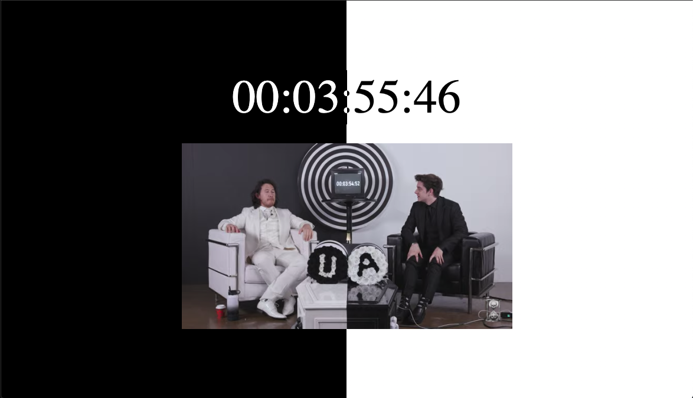

# Unus Annus End Times

By the time you see this page, Unus Annus would have ended.

Unus Annus was an ongoing puzzle/project that was launched on November 15th, 2019. 
It was made by Ethan "CrankGameplays" Nestor and Mark "Markiplier" Fischbach. 
The main point is that the channel will be deleted 1 year after the first video got uploaded. 
The project's theme is about death and time as Unus Annus in Latin is "One Year" and Memento Mori in Latin is "remember death". 
The channel is very Unique and was/will be deleted on November 13th, 2020, at midnight, to sustain the theme.

This page included the original embedded livestream that was streamed on YouTube on the final day of Unus Annus.
After the countdown has completed, this page will only have the words "Memonto Mori".

